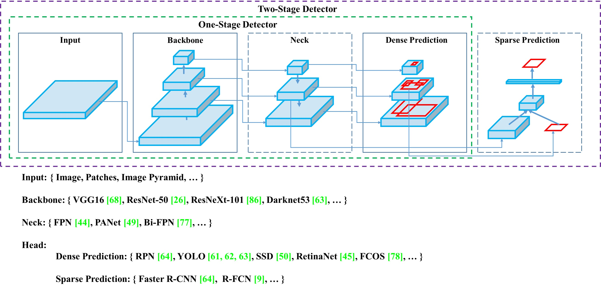
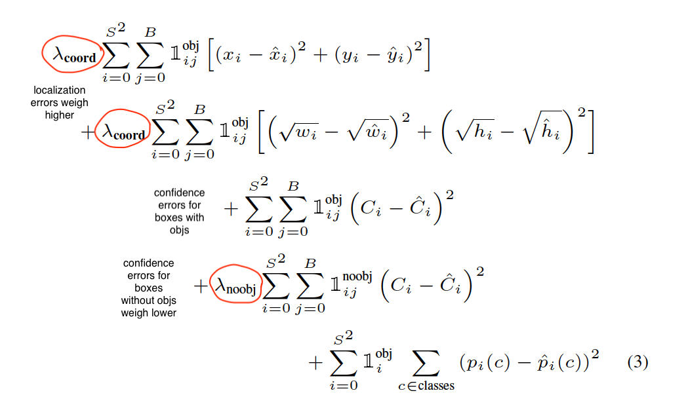
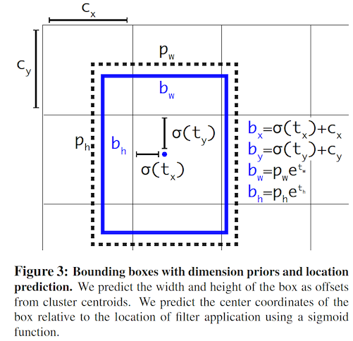
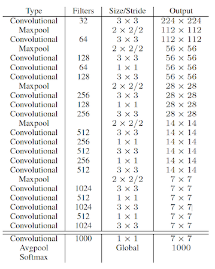
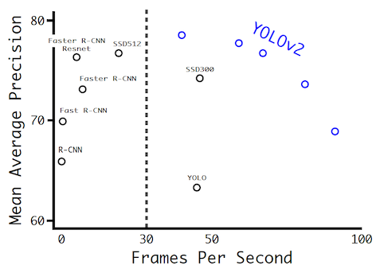
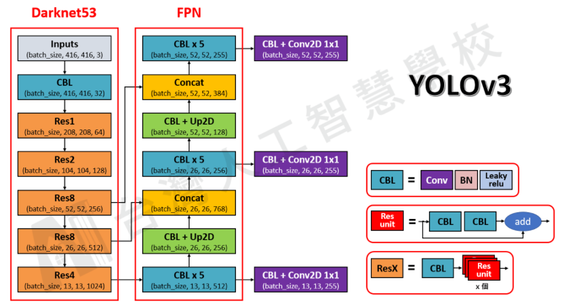
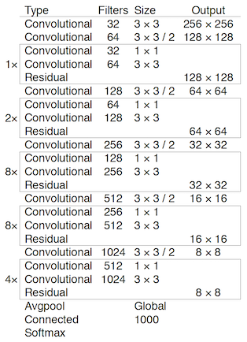
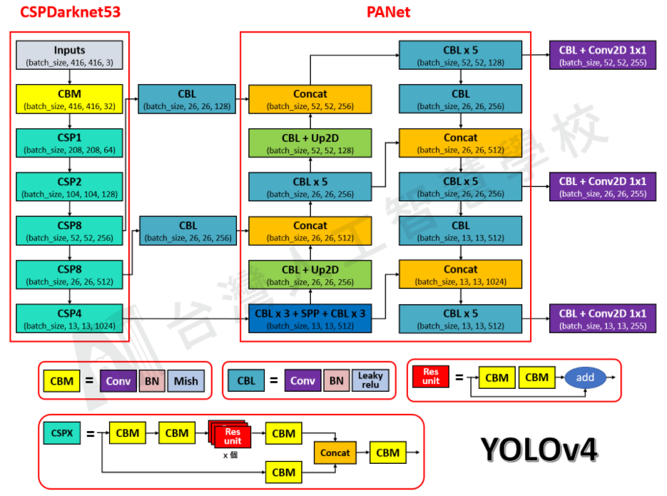
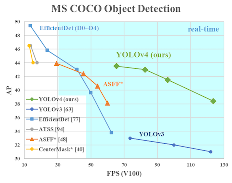

# Architectures
## Designs

## Scaling
## FPN
## PAN
---
# Region Propposal
Basic steps:
- region proposal
- resample pixels / features of ROI
- classfication / regression of ROI
## RCNN
#### Multi stages:
- separate region proposal 
- warp regions (e.g. 227x227)
- compute CNN features for __each region__ -> super slow
- write features to disk
- classify features using SVM
- NMS

#### Training
- pre-trained CNN (imagenet)
- finetune CNN
    - input: warped region proposals
    - output: N + 1 classes
    - positive / negative sampling
- SVM: 1 per class
    - hard negative mining
- bbox regression

#### Evaluation
- VOC 2010: mAP = 53.7%
## SPP
#### Architecture
- no fixed size region proposals
- CNN computes __arbitrary-size features__
- CNN runs only __once__ (<> RCNN) on the entire image -> __crop features from feature maps__
- pool features and genereate fixed-length outputs

#### Training
- finetune CNN
    - variable-size images
    - inefficient to update layers before SPP layer
        - each sample (ROI) from a different image -> no sharing
- SVM
- bbox regression
## Fast RCNN
#### Architecture
- CNN computes features once per image
- ROI pooling to pool features -> fixed-length feature vectors
- classification and regression branches

#### Training
- pre-trained on imagenet
- efficient training:
    - sample N images, R // N ROIs per image -> share computation & memory from the same image
    - choose N small
- single-stage, multi-task losses
    - cls loss: log loss
    - loc loss: smoothed L1 loss -> avoid exploding grads when training with unbounded targets + L2 loss
    
#### Evaluation

## Faster RCNN
#### Architecture
- RPN head: 
    - Anchor boxes: different AR and scales (sliding windows?), wrt corresponding FPN layer. Each anchor predicts
        - classification scores (2 classes)
        - 4 regression coefs
    - network structure
        - input: feature maps W/S x H/S x C -> num_anchor_boxes = W/S x H/S x num_boxes_per_anchor
        - small 'neck' (to reduce channels??): W/S x H/S x C -> W/S x H/S x C'
        - classification head: W/S x H/S x C' -> W/S x H/S x C'x (num_boxes_per_anchor x 2)
        - regression head: W/S x H/S x C' -> W/S x H/S x C' x num_boxes_per_anchor x 4
    - training:
        - positive & negative anchors based on IOU
    - inference:
        - inputs: images + backbone (+FPN) features (batch_sz = num images)
        - outputs: max proposals (bbox)
- ROI head
    - box_roi_pool: crop proposals (batch_sz = num_proposals) from RPN and use cropped regions to pool features from backbone
    - box_head: outputs box_features from pooled features
    - box_predictor: predicts cls / bbox
    - post process results of box_predictor to obtain num_instances bboxes + cls
    - inference
        - inputs: total num proposals (batch_sz) + backbone features
        - outputs: num_instances bboxes + cls

#### Training

#### Evaluation
- VOC
- COCO
- Inference
    - 5 FPS
## Mask RCNN - ROI Align
Faster RCNN plus a mask head

### Mask head
* mask_roi_pool: crop mask proposals (batch_sz = num_instances) from box_head and use cropped regions to pool features from backbone
* mask_head: outputs mask_features from pooled features
* mask_predictor
* inference:
    * inputs: num_instances bboxes / cls + backbone features
    * outputs: num_instances masks

### RoIAlign
* RoIPool:
    * quantizes a floating-number RoI to the discrete granularity of the feature map
    * quantized RoI is then subdivided into spatial bins which are themselves quantized
    * bins are aggregated
    * -> Quantizations introduce misaligment between the RoI and extracted features
* RoIAlign: properly align the extracted features with the input, avoid any quantization of the RoI boundaries or bins (e.g. x/16 instead of [x/16])
    * given feature maps and RoI (not quantized) in feature map coordinates
    * the RoI is divided into mxn bins (in feature map coordinates)
    * for each RoI bin in the feature maps, sample 4 (or any number) regularly sampled locations (using bi-linear interpolation to compute exact values, no quantization needed)
    * aggregate the sampled locations
    * results are not sensitive to the exact sampling locations, or number of samples
## RFCN
#### fully convolutional
* traditional: 2 sub-networks divided by ROI pooling layer (e.g. VGG)
    * fully convolutional
    * ROI-wise: not share computation
* fully convolutional (e.g. ResNet)
    * not work for detection
    * ResNet's remedy: insert ROI pooling layer between 2 sets of ResNet-101 conv layers (before conv5_1) -> creates a deeper ROI-wise subnetwork that improves accuracy
    * -> cause by a dilemma of increasing translation __invariance__ for classification vs respecting translation __variance__ for detection -> ResNet region-specific operation, ROI pooling layer, breaks down translation invariance
* RFCN
    * fully convolutional: improves efficiency
    * to incorporate translation variance: construct a set of position-sensitive score maps
    
#### architecture
* abc

#### evaluation
ResNet-101 backbone + RFCN:
* VOC 2007: mAP=83.6%
* VOC 2012: mAP=82.0%
* 170ms / image (2.5x to 20x faster than Faster-RCNN)
---
# Single Shot
No region proposal or resampling
## SSD

- default boxes: 
    - one set (e.g. 4, 6) per location of each feature map (that is used for prediction)
    - different AR and scales
    - each default box outputs a detection prediction: K+5
        - K+1 class scores, including background (<> anchors of faster RCNN)
        - 4 bbox params (class agnostic)
        - each feature map is applied a conv__3x3__x [num_boxes x (K+1+4)] -> output feature map of K+5 channels
        - NOTE: a class-dependent prediction would output K * 4 bbox params and K+1 class scores -> 5K+1 channels (too many?!). Most models predict class-agnostic bboxes.
    - e.g. SSD300:
        - 8732 predictions = 38x38x4 + 19x19x6 + 10x10x6 + 5x5x6 + 3x3x4 + 4 
        - [4, 6, 6, 6, 4, 4]: number of default boxes per feature map (empirically determined)
    - combines preds from multiple feature maps using NMS
- fixed input size: SSD300 etc.

#### Training

#### Evaluation
---
## YOLOv1
- regression directly from pixels to bbox & cls (no anchors)
- divide image into SxS grid, each cell outputs 
    - B objects ( bbox (x,y,w,h) (4 params) + its confidence score (1 param)  ) -> B * 5 params
        - _(x,y)_: center of the bbox relative to the bounds of the cell
        - _(w,h)_: relative to the whole image
        - _confidence score_ = `P(bbox contains obj & bbox is the accurate)` = how confident the model is that the bbox contains an obj (P(obj)) __AND ALSO__ how accurate it thinks the box is that it predicts (accuracy)
            - __training__: break confidence score into `target confidence = I(objectness) * IOU(truth, pred)`
                - `P(obj) = I(objectness)`: if the predicted bbox contains obj
                - `accuracy = IOU(truth, pred)`: IOU of the predicted bbox and the obj
            - __test__: cannot break down the confidence
                - confidence = model output
    - C cls probs, not including background, P(cls|obj) (conditioned on the grid cell containing an obj), regardless of the number of bboxes B
        - -> only predict 1 class per grid cell
        - __training__: `P(cls|obj) = I(the bbox contains an obj of class cls)`
        - __test__:
            - class-specific __confidence scores__ for each box: $P(cls|box) = P(cls|obj) * P(obj) * IOU$
            - `P(cls|box)` encodes __both__ prob of the cls in box (P(cls|obj)) __and__ how well the box fitted the obj (P(obj)*IOU)
    - &rarr; outputs S x S x (B * 5 + C) tensor
- uses features from the entire image to predict each bbox
- predicts all bboxes across all classes for an image simultaneously
- grid design imposes strong spatial constraints
- YOLO's cell v.s SSD's default box
[YOLOv1](https://towardsdatascience.com/yolov1-you-only-look-once-object-detection-e1f3ffec8a89)

Code: https://www.kaggle.com/code/vexxingbanana/yolov1-from-scratch-pytorch
#### Features
- grid design imposes strong spatial constraints
    - mitigate multiple detections of the same obj
    - proposes far fewer bbox (98 for VOC 2007)
- limitations:
    - limits number of nearby objs
    - uses coarse features due to multiple downsampling layers
    - predicts bbox coordinates directly using FC layers
        - -> significant number of __localization__ errors
    - low recall
#### Nework design

- conv layers (24): extract features
- FC layers (2): 
    - predict output probs & bboxes
    - applied to __flatten__ feature maps of the last conv layer
- output: 7x7x30 tensor (reshaped output of FC layer)
#### Training
- pre-trained on ImageNet 224 x 224
    - 20 conv layers + avg_pool + 1 FC
- detection: add 4 conv and 2 FC layers, 448x448 resolution
- normalize bbox w & h by image size -> [0, 1]
- normalize bbox x, y as offsets of grid cells -> [0, 1]
- predicts sqrt of bbox width and height to alleviate equal errors of large & small bbox
- LeakyRELU
- loss: sum of squared errors
    - easy to optimize
    - weighs localization and classification errors the same
    - imbalanced: most grid cells have no objs
        - increase loss from bbox coordinates predictions
        - decrease loss from confidence predictions for bbox not containing objs
        

#### Evaluation
- Input: 448 x 448
- VOC 2007: mAP = 63.4%
- VOC 2012: mAP = 57.9%
* Inference
    - YOLO: 
    - Fast YOLO: >150 FPS
## YOLOv2 (9000): 
Links:
* https://pyimagesearch.com/2022/04/18/a-better-faster-and-stronger-object-detector-yolov2/
* [YOLOv2](https://pjreddie.com/darknet/yolov2/)
* [YOLOv2](https://towardsdatascience.com/review-yolov2-yolo9000-you-only-look-once-object-detection-7883d2b02a65)

Code: 
* https://github.com/experiencor/keras-yolo2
* https://github.com/jmpap/YOLOV2-Tensorflow-2.0
* https://github.com/uvipen/Yolo-v2-pytorch/blob/master/src/yolo_net.py

#### Features
- batchnorm
- high resolution classifier (448 x 448)
- conv with anchor boxes -> reduce localization errors of v1
    - remove FC layers and use conv + anchor boxes
    - predict offsets from anchor boxes is simpler (???)
    - 416 input images instead of 448 -> feature map of 13x13, having a center to predict objs instead of 4 nearby points
    - anchors propose >1k boxes v.s 98 boxes of v1
    - when move to anchor boxes, also decouple class prediction from spatial location (like v1) -> instead, predict class and objectness for every anchor box
        - class: P(cls|obj) as in v1
        - objectness: IOU as in v1
- dimension cluster: 
    - k-means on training set to find priors for anchor boxes
    - better than hand-picked priors
    - 5-9 priors
- direct bbox center location prediction
    - predicting offsets relative to priors (like RPN) is unstable (unconstrained)
        - predict $t_x$ ($ x=t_x*w_a-x_a$) &rarr; $t_x$ unconstrained
    - instead, like v1, predict location coordinates relative to the location of the grid cell 
        - each location in feature map corresponds to a grid cell (13x13)
        - each predicts 5 anchor boxes
        - each anchor box predicts 
            - coordinates $t_x$ (bbox center $b_x=c_x+\sigma(t_x)$; $c_x$: grid cell location)
            - (ignore priors coordinates, using sizes only)
            - sizes $t_w$ ($b_w=p_w*e^{t_w}$)
        - &rarr; constrained ([0, 1]) &rarr; more stable
    - 
- fine-grained features
    - add a passthrough layer from the early layer (26x26), concatenate by stacking: 26x26x512 -> 13x13x2048, concatenated with final layer
- multi-scale training
#### Architecture
Darknet19
- downsample 32

#### Evaluation
- VOC 2007: 78.6 mAP (YOLOv2 544x544)

- Inference
    - YOLOv2 544x544: 40 FPS
    - YOLOv2 480x480: 59 FPS
    - YOLOv2 416x416: 67 FPS
## YOLOv3
### Architecture

### Features
- replace max pools with strided conv
- add residuals
- SPP
- bbox prediction
    - same as v2: anchor box - dimension cluster, predicts coordinates directly
    - loss: sum of squared errors (no focal loss)
    - logreg for obj scores
    - only assign 1 anchor to each ground truth obj
- cls prediction
    - use independent logreg classifiers instead of softmax
    - binary cross entropy loss
- predictions across scales
    - head: 3 different scales
    - neck: similar to FPN, but concat instead of sum
- feature extractor
    - darknet-53
        - downsample: 48/96?
    
    
### Training
- full images without hard negative mining
- augmentation
### Evaluation
- Input: 256 x 256, single crop
- almost on par with retinanet, much better SSD in AP
    - -> very strong detectors that excel at producing decent boxes (high AP50)
- performance drops significantly when increase IOU
    - -> struggle to get the boxes perfectly aligned with the obj (lower mAP)
- COCO 2017: 
    - YOLO 320: mAP = 28.2
    - YOLO 416: mAP = 31.0
    - YOLO 608: mAP = 33.0
- Inference:
    - YOLOv3 608: 20 FPS
### References:
- https://pyimagesearch.com/2022/05/09/an-incremental-improvement-with-darknet-53-and-multi-scale-predictions-yolov3/
## YOLOv4
### References
- https://pyimagesearch.com/2022/05/16/achieving-optimal-speed-and-accuracy-in-object-detection-yolov4/
#### Architecture

#### Features
- Backbone
    - CSPDarkNet53
    - CSP
    - Multi-input weighted residual connection (MiWRC)
    - Mish activation    
    - Augmentation
        - Cutmix
        - Mosaic
    - Regularization
        - DropBlock
        - label smoothing 
- Neck
    - additional block: 
        - modified SPP over CSPDarkNet53: 
            - significantly increases the receptive field
            - only at the first computation list group of the neck
        - modified SAM: spatial-wise attention to point-wise attention
    - path-aggregation: use PAN instead of FPN
        - modified PAN: concatenation instead of addition
        - no CSP (as opposed to scaled-YOLOv4)
- Head
    - YOLO3 anchors
- Detector
    - CIoU loss
    - eliminate grid sensitivity
    - Cross mini-Batch Normalization (CmBN), no syncBN
    - Multiple anchors for a ground truth
    - Regularization
        - DropBlock
    - Augmentation
        - Mosaic
        - Self-adversarial training
#### Training
#### Evaluation
- COCO 2017: 
    - YOLO 416: mAP = 41.2
    - YOLO 512: mAP = 43.0
    - YOLO 608: mAP = 43.5 (AP50 = 65.7)

#### References
- https://sh-tsang.medium.com/review-yolov4-optimal-speed-and-accuracy-of-object-detection-8198e5b37883
- https://jonathan-hui.medium.com/yolov4-c9901eaa8e61
- https://becominghuman.ai/explaining-yolov4-a-one-stage-detector-cdac0826cbd7
## Scaled-YOLOv4
#### Architecture
* YOLOv4-large

* YOLOV4-tiny

#### Scaling principles
- Scaling by CSP
- Tiny models
    - use networks with efficient param utilization: DenseNet, OSANet (VoVNet) -> OSANet
    - minimize / balance size of feature map
    - maintain the same number of channels after conv
    - minimize conv IO
- Large models
    - first perform compound scaling on input_size and no. stage, then depth and width
    - 
    
#### Features

- Training:
    - EMA
#### Evaluation

- P7: mAP = 56
#### References
- https://alexeyab84.medium.com/scaled-yolo-v4-is-the-best-neural-network-for-object-detection-on-ms-coco-dataset-39dfa22fa982
## YOLOv5

- https://docs.ultralytics.com/
#### Features

- similar to v4 but in PyTorch
- 5 scaleed versions
#### Evaluation

- YOLO 640: mAP = 50.7
- YOLO 1536: mAP = 55.8
## YOLOR
#### Evaluation

- mAP = 55.4
## YOLOX
## YOLOv6
### Evaluation

- mAP = 52.5
## YOLOV7
---
## RetinaNet
---
# Anchor-free
## FCOS
---
# Text Detection
## EAST
---
## Basics
- https://cv-tricks.com/object-detection/faster-r-cnn-yolo-ssd/
## Metrics
- https://github.com/rafaelpadilla/Object-Detection-Metrics
- mAP: https://medium.com/@timothycarlen/understanding-the-map-evaluation-metric-for-object-detection-a07fe6962cf3
- COCO eval: https://pyimagesearch.com/2022/05/02/mean-average-precision-map-using-the-coco-evaluator/
# References
* [Object Detection and Classification using R-CNNs](http://www.telesens.co/2018/03/11/object-detection-and-classification-using-r-cnns/)
* [Faster R-CNN: Down the rabbit hole of modern object detection](https://tryolabs.com/blog/2018/01/18/faster-r-cnn-down-the-rabbit-hole-of-modern-object-detection/)
* https://medium.com/@whatdhack/a-deeper-look-at-how-faster-rcnn-works-84081284e1cd
* https://towardsdatascience.com/review-faster-r-cnn-object-detection-f5685cb30202
* https://medium.com/@fractaldle/guide-to-build-faster-rcnn-in-pytorch-95b10c273439
* https://towardsdatascience.com/deep-learning-for-object-detection-a-comprehensive-review-73930816d8d9
* https://medium.com/zylapp/review-of-deep-learning-algorithms-for-object-detection-c1f3d437b852